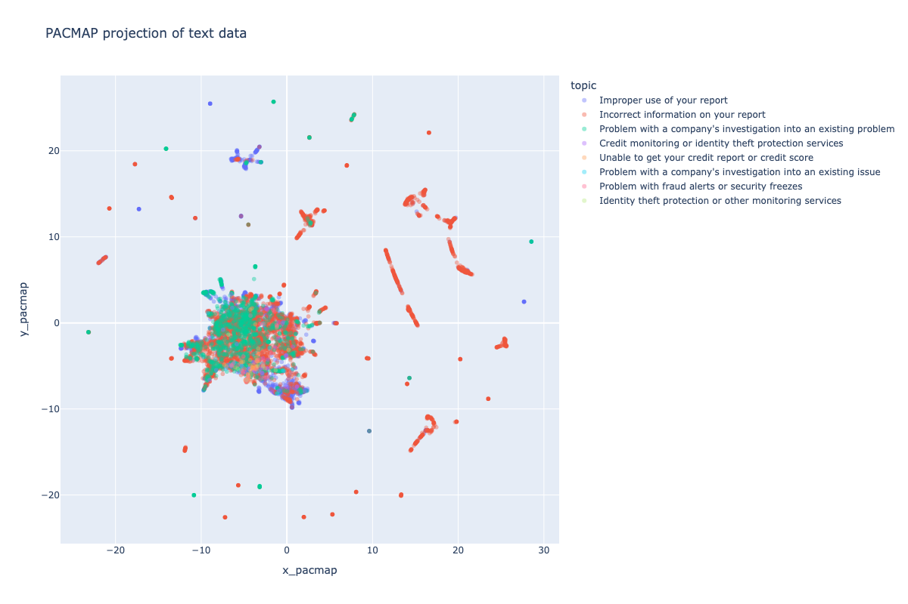

# semaptic

Semaptic is a utility for Colab to take a CSV, embed the text column with either OpenAI or Gemini embeddings, and then visualize the results in a 2D space with PacMap (or Umap or T-SNE). The processed data with embeddings and coordinates is saved in SQLite format for efficient storage and retrieval.

This helps you explore large text datasets -- you can explore lots of regions on the map and see fewer boring duplicates.

You can try it in action [in this Colab notebook](https://colab.research.google.com/drive/1Y1-lUxXIBpakLyxKu9HUyulqv9IugcYy#scrollTo=kjmcnC-iUsVf)

## Demo Image

Here is a screenshot of a bunch of FTC complaints about a credit monitoring company, visualized with PacMAP.

## TODO list

- [ ] should the embed_reduce_and_map function print itself out, so users can modify it (e.g. to do some light data cleaning on their text column)?
- [ ] use the Gemini embedding types (clustering, semantic search, etc.) and see if that means we get better results.
- [ ] add instructions to the default colab.